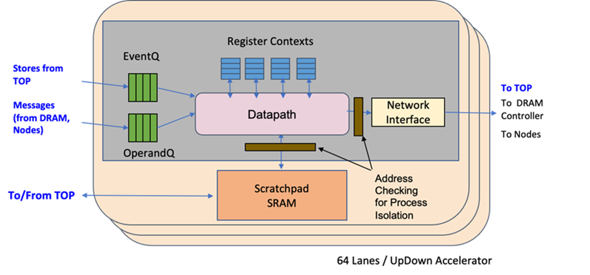
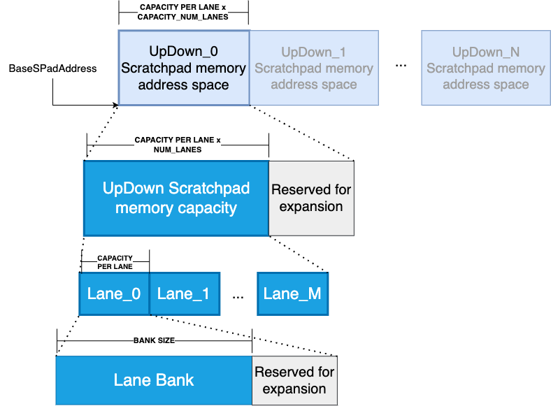
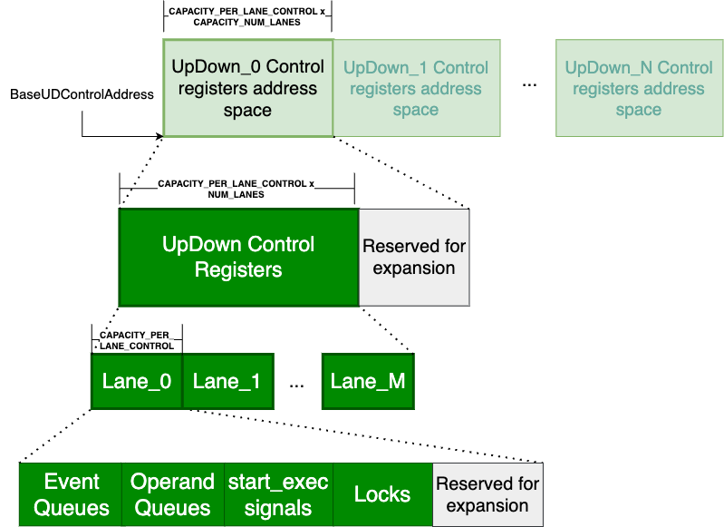

# Kickstart tutorial

The purpose of this document is to summarize the hello world tutorial to be presented in the first quick off meeting of the UpDown Runtime Emulator. This tutorial will likely be out of date in the future, so be warned that this may be outdated if you read it beyond October 21st 2022.
The content of this document is as follows:

1. Building the runtime in standalone mode
2. Small terminology reminder
3. Creating a hello world program

## Building the runtime system in standalone mode

In the long term, the purpose of this runtime system is to be part of the backend of more interesting ideas to be explored with the help of compilers. However, for now 
it is possible to build the runtime in stand alone mode, generating both a static and dynamic versions of these libraries.

The runtime has two parts. A `runtime` that is meant to be used with a simulator or the real hardware (e.g. pointers are accessed directly), and a `simruntime` that creates a wrapper around a python emulator, and which should be API compatible with the `runtime`. Furthermore, this repository hosts a set of microbenchmarks, and some experimental elements to be used with compilers in the future.

In order to build the runtime in stand alone we will use cmake. We will use two locations: `UPDOWN_SOURCE_CODE` and `UPDOWN_INSTALL_DIR`. Change these accordingly. Let's begin by creating the work environment.

```Bash
# Create a work folder. Set env variables
mkdir updown_tutorial
cd updown_tutorial
git clone git@bitbucket.org:achien7242/llvm.git
mkdir build
mkdir install
mkdir exercises
export UPDOWN_SOURCE_CODE=`pwd`/llvm/updown
export UPDOWN_INSTALL_DIR=`pwd`/install
```

Now let's begin the compilation. This assumes you're in the updown_tutorial folder, as described above

```bash
# Let's build things
cd build
cmake $UPDOWN_SOURCE_CODE -DUPDOWNRT_ENABLE_TESTS=ON -DUPDOWNRT_ENABLE_UBENCH=ON -DUPDOWN_ENABLE_DEBUG=ON -DCMAKE_INSTALL_PREFIX=$UPDOWN_INSTALL_DIR
make -j
make install
```

In this step we are using the following flags:

* **UPDOWNRT_ENABLE_TESTS=ON** - This enables compilation of the different runtime tests (e.g. chech _simupdown/tests_ folder). These are good resources for examples on how to use the runtime API, but also it help us see if there are any mistakes.
* **UPDOWNRT_ENABLE_UBENCH=ON** - This enables compilation of the different microbenchmarks (e.g. chech _ubenchmarks_ folder). These were created to stress the runtime. While in the emulator mode they do not really faithfully measure performance (i.e. functional simulator), these are useful for verifying behavior and learning.
* **UPDOWN_ENABLE_DEBUG=ON** - This enables debug messages in the runtime. When running programs, you will see a lot of lines that read `[UPDOWN_INFO: file.cpp:line_number]`. Some messages are information, others are errors or warnings. These are useful to understand the interaction with the system. For long runs, you should build the runtime without debug mode.
* **UPDOWN_INSTALL_DIR=...** - This flag is necessary to be able to create a distributable runtime library.

### Notes
At the moment of writing this tutorial, the tests do not properly verify results, so these are verified by eyeballing the output. This is to be solved in the future.

## Small terminology reminder
This is just a quick remider of the updown terminology. 

### UpDowns, lanes and threads
The updown hardware is divided into UpDown units that contain multiple Lanes (e.g. 64 lanes). See the following picture for a representation of the updown lane.



Each lane has an operand queue and an event queue. In order to send an updown event we need to set both separately. In the API runtime, we will see that the `UpDown::operands_t` class is used for creating the operands, and the `UpDown::event_t` is used to create an event. This event receives the `operands_t` as part of the arguments.

Each updown lane can have multiple activations. Currently, we refer to these activations as threads (See register contexts in the figure above). These "threads" execute concurrently, and they are switched upon execution of a `yield` or `yield_terminate` operation by another thread, and the arrival of a new event that "wakes up" a thread.

Each updown has access to some scratchpad memory.

### UpDown memory address space

From the perspective of the top it is possible to access the updown scratchpad and control signals. Each updown has a set of memory regions that is parametrized according to some values. 

The following figure represents the address space for the scratchpad memory, as seen from the top, considering multiple updowns.



The following figure represents the address space for the control signals for the different updowns, as seen from the top. 



It is important to understand these signals:

* **Queues** These represent the location of the operand and event queues. It is used by the send event to submit a new event and its operands to the queue
* **Start exec** This signal is necessary because as of right now, the top does not perform an atomic operation to add events and operands. Therefore, it needs to signal the lane that a new event is ready for consumption. This may change in the future, but it is the mechanism we currently have in place 
* **Locks** Since these operations are not atomic, in order to guarantee atomic access from other events (i.e. that operands and events that are related to each other are inserted in the right order), this signal is needed to lock the queues. This will be set and unset by the send event mechanism

### Notes
At the moment of writing this tutorial, the updown runtime is not thread safe. Avoid calling updown runtime methods from multiple top threads, or use required critical regions.

## Creating a hello world program

Now let's create our first hello world program. this program will receive a number in an event operand, and it will send that number back with its value incremented by 1.

The Top code will look like this:

```C
//// Copy and paste this to a file name mainAddOne.cpp
#include "simupdown.h"

int main() {
  // Default configurations runtime
  UpDown::SimUDRuntime_t *test_rt = new UpDown::SimUDRuntime_t("addOneEFA", "AddOne", "./");

  printf("=== Base Addresses ===\n");
  test_rt->dumpBaseAddrs();
  printf("\n=== Machine Config ===\n");
  test_rt->dumpMachineConfig();

  // Help operands
  UpDown::word_t ops_data[] = {99};
  UpDown::operands_t ops(1, ops_data);

  // Events with operands
  UpDown::event_t evnt_ops(0 /*Event Label*/,
                           0 /*UD ID*/,
                           0 /*Lane ID*/,
                           UpDown::CREATE_THREAD /*Thread ID*/,
                           &ops /*Operands*/);

  test_rt->send_event(evnt_ops);
  test_rt->start_exec(0,0);

  test_rt->test_wait_addr(0,0,0,100);

  return 0;
}

```

The UpDown program

```Python
### Copy and paste this to a file name addOneEFA.py. 
### Notice this name matches the runtime initialization above
from EFA import *

def AddOne():
    efa = EFA([])
    efa.code_level = 'machine'
    
    state0 = State() #Initial State? 
    efa.add_initId(state0.state_id)
    efa.add_state(state0)
    state1 = State() #Initial State? 

    #Add events to dictionary 
    event_map = {
        'add_1':0
    }

    tran0 = state0.writeTransition("eventCarry", state0, state1, event_map['add_1'])
    tran0.writeAction("mov_ob2reg OB_0 UDPR_1")
    tran0.writeAction("addi UDPR_1 UDPR_1 1")
    tran0.writeAction("mov_imm2reg UDPR_2 0")
    tran0.writeAction("mov_reg2lm UDPR_1 UDPR_2 4")
    tran0.writeAction("yield_terminate 2" )
    return efa

```

Let's add these files to the exercises folder we created earlier, and copy and paste the content of each of the code segments above. Then we should be able to compile it with the following command

```Bash
g++ mainAddOne.cpp -I$UPDOWN_INSTALL_DIR/updown/include -L$UPDOWN_INSTALL_DIR/updown/lib -lUpDownSimRuntime -lUpDownRuntime /usr/lib64/libpython3.6m.so -o mainAddOne.exe
# Before running make sure LD_LIBRARY_PATH contains the lib folder from the installation above
export LD_LIBRARY_PATH=$UPDOWN_INSTALL_DIR/updown/lib
./mainAddOne.exe
```

### Output:

```
[UPDOWN_INFO: updown.cpp:16] calc_addrmap: maddr: 0x80000000 spaddr: 0x200000000 ctrlAddr: 0x600000000
[UPDOWN_INFO: simupdown.cpp:15] Allocating 4294967296 bytes for mapped memory
[UPDOWN_INFO: simupdown.cpp:20] Allocating 2147483648 bytes for Scratchpad memory
[UPDOWN_INFO: simupdown.cpp:26] Allocating 2097152 bytes for control
[UPDOWN_INFO: simupdown.cpp:31] MapMemBase changed to 0x7F861DEF7010
[UPDOWN_INFO: simupdown.cpp:35] SPMemBase and UDbase changed to 0x7F859DEF6010
[UPDOWN_INFO: simupdown.cpp:38] ControlBase changed to 0x7F859DCF5010
[UPDOWN_INFO: upstream_pyintf.cc:56] Adding system paths: "./emulator:/home/jmonsalvediaz/tmp/updown_tutorial/install/updown/lib/emulator:/home/jmonsalvediaz/tmp/updown_tutorial/llvm/updown/simruntime/src/emulator"
[UPDOWN_INFO: upstream_pyintf.cc:82] Creating UpStream PyIntf with 1 lanes 65536 banksize
DataStore Size:65536
[UPDOWN_INFO: upstream_pyintf.cc:97] Initialized UpStream Python Interface with addOneEFA and AddOne
[UPDOWN_INFO: upstream_pyintf.cc:110] UpStream PyIntf, EFA created 
[UPDOWN_INFO: upstream_pyintf.cc:116] UpStream Processor Setup_Sim done 
[UPDOWN_INFO: updown.cpp:16] calc_addrmap: maddr: 0x7F861DEF7010 spaddr: 0x7F859DEF6010 ctrlAddr: 0x7F859DCF5010
=== Base Addresses ===
  mmaddr     = 0x7F861DEF7010
  spaddr    = 0x7F859DEF6010
  ctrlAddr  = 0x7F859DCF5010

=== Machine Config ===
  MapMemBase          = 0x7F861DEF7010
  UDbase              = 0x7F859DEF6010
  SPMemBase           = 0x7F859DEF6010
  ControlBase         = 0x7F859DCF5010
  EventQueueOffset    = (0x0)0
  OperandQueueOffset  = (0x1)1
  StartExecOffset     = (0x2)2
  LockOffset          = (0x3)3
  CapNumUDs           = (0x80)128
  CapNumLanes         = (0x80)128
  CapSPmemPerLane     = (0x20000)131072
  CapControlPerLane   = (0x80)128
  NumUDs              = (0x1)1
  NumLanes            = (0x1)1
  MapMemSize          = (0x100000000)4294967296
  SPBankSize          = (0x10000)65536
  SPBankSizeWords     = (0x40000)262144
[UPDOWN_INFO: updown.cpp:27] Locking 0x7F859DCF501C
[UPDOWN_INFO: updown.cpp:34] Sending Event:0 to [0,0,255] to queue at  0x7F859DCF5010
[UPDOWN_INFO: updown.cpp:39] Using Operands Queue 0x7F859DCF5014
[UPDOWN_INFO: updown.cpp:44] OB[0]: 0 (0x0)
[UPDOWN_INFO: updown.cpp:44] OB[1]: 99 (0x63)
[UPDOWN_INFO: updown.cpp:46] Unlocking 0x7F859DCF501C
[UPDOWN_INFO: upstream_pyintf.cc:151] Lane:0 Pushed into Operand Buffer: 0
[UPDOWN_INFO: upstream_pyintf.cc:151] Lane:0 Pushed into Operand Buffer: 99
[UPDOWN_INFO: upstream_pyintf.cc:139] Pushed Event:0, lane:0, tid:255 numop:1 
[UPDOWN_INFO: updown.cpp:62] Starting execution UD 0, Lane 0. Signal in  0x7F859DCF5018
[UPDOWN_INFO: upstream_pyintf.cc:293] EFA execute output, LaneID:0, Return State:-1, Num Sends: 0                            Exec_cycles:6, Actcnt:5 
[UPDOWN_INFO: simupdown.cpp:104] C++ Process executed python process - Returned -1
[UPDOWN_INFO: simupdown.cpp:263] Lane: 0 Yielded and Terminated - Writing result now
[UPDOWN_INFO: updown.cpp:139] Testing UD 0, Lane 0 to Top, offset 0. Addr 0x7F859DEF6010. Expected = 100, read = 100
[UPDOWN_INFO: updown.cpp:153] Testing UD 0, Lane 0 to Top, offset 0. Addr 0x7F859DEF6010. Expected = 100, read = 100. (Returning)
```

You can now play with the code above. An example is changing the debug level of the emulator itself through the interface:

```C++
// Change the following line for:
//UpDown::SimUDRuntime_t *test_rt = new UpDown::SimUDRuntime_t("addOneEFA", "AddOne", "./");
UpDown::SimUDRuntime_t *test_rt = new UpDown::SimUDRuntime_t("addOneEFA", "AddOne", "./", UpDown::EmulatorLogLevel::FULL_TRACE);
```

Build again and execute, you should be able to see each UpDown instruction being executed.


## Gather program

This is another fun program that demonstrates the flexibility of UpDown. In this program we would like to change the view that the top has of a data structure in DRAM. Instead of fetching the whole data structure, we gather the elements we want from DRAM into an array representation into the scratchpad memory, such that it can be read by the top directly. 

In the code below, the first thing we do is modify the machine configuration to consider up to 64 lanes. 

The top program allocates an array into the mapped memory `mm_malloc`. This address corresponds to a DRAM pointer. Mapped memory is necessary because the lack of support for virtual address translation in the UpDown. Therefore, we get a pointer that can be used by both the top and the downstream to read directly.

Following we initialize the first position of the scratchpad memory of each UpDown lane. This is later on used to determine when the program has finished.

An event is created per lane. Each lane is assigned a chunk of the original array. The event has the following five operands:

* **DRAM Pointer in Operands 0 and 1:** Since top pointers are 64 bits, and updown operands are 32 bits, we need 2 operands to hold pointers.
* **Initial pointer to memeory in Operand 2:** Each lane will be in charge of a chunk. This pointer refers to the beginning of the chunk, bypassing the elements of the struct that are not to be copied. 
* **Distance between elements in Operand 3:** Since we want to skip elements, we can use this operand to know how many elements we need to skip. This is the size of the struct.
* **Chunk size in Operand 4:** This is how many elements to fetch for each lane. This is, the size of the chunk that each lane is assigned. 

We send an event to each lane that takes place in the computation, initialize the execution, wait for it to complete, and finally fetch one element at from scratchpad memory into the top (i.e. `ud2t_memcpy`).

Following is the code for the top:

```C++
//// Copy and paste this to a file name mainStructArray.cpp
#include "simupdown.h"

#define N 100
#define CHUNK 10

struct myStruct {
  int a;
  int b;
  int c;
  int d;
};

int main() {
  // Set up machine parameters
  UpDown::ud_machine_t machine;
  machine.NumLanes = 64;

  // Default configurations runtime
  UpDown::SimUDRuntime_t *test_rt = new UpDown::SimUDRuntime_t(machine, "structArrayEFA", "structArray", "./", UpDown::EmulatorLogLevel::NONE);

  printf("=== Base Addresses ===\n");
  test_rt->dumpBaseAddrs();
  printf("\n=== Machine Config ===\n");
  test_rt->dumpMachineConfig();

  // Allocate the array where the top and updown can see it:
  myStruct* str = reinterpret_cast<myStruct*>(test_rt->mm_malloc(N*sizeof(myStruct)));

  // Populate the array of structs
  for (int i = 0; i < N; i++)
    str[i].c = i+1;

  // Initialize Scratchpad memory
  // The first location of each lane will be used to check completion of code
  for (int i = 0; i < N/CHUNK; i++) {
    UpDown::word_t value = 0;
    test_rt->t2ud_memcpy(&value /*Pointer to top data*/, 
                         sizeof(UpDown::word_t) /*Size in bytes*/,
                         0 /*UD ID*/,
                         i /*Lane ID*/,
                         0 /*Offset*/);
  }

  // operands
  // 0 and 1: Pointer to DRAM (operands are 32 bits, pointers are 64 bits)
  // 2: Initial Offset to memory
  // 3: Distance between elements
  // 4: Number of elements to fetch
  UpDown::word_t ops_data[5];
  UpDown::operands_t ops(5, ops_data);
  ops.set_operands(0,2,&str);
  ops.set_operand(3, sizeof(myStruct)); // Assume N divisible by CHUNK
  ops.set_operand(4, CHUNK);

  for (int i = 0; i < N/CHUNK; i++) {
    // We will fetch c, which is offset by a, and b. Pointer arithmetic may be better here
    ops.set_operand(2, sizeof(myStruct)*i*CHUNK + sizeof(int)*2);
    // Events with operands
    UpDown::event_t evnt_ops(0 /*Event Label*/,
                             0 /*UD ID*/,
                             i /*Lane ID*/,
                             UpDown::CREATE_THREAD /*Thread ID*/,
                             &ops /*Operands*/);
    test_rt->send_event(evnt_ops);
    test_rt->start_exec(0,i);
  }

  for (int i = 0; i < N/CHUNK; i++) {
    test_rt->test_wait_addr(0,i,0,1);
    for (int j = 0; j < CHUNK; j++) {
      int val;
      // Skip the first element since it is our termination signal
      // Access the other elements one by one
      uint32_t offset = sizeof(UpDown::word_t) + j*sizeof(int);
      test_rt->ud2t_memcpy(&val, sizeof(int), 0, i, offset);
      printf("str[%d].c = %d\n", i*CHUNK + j, val);
    }
  }

  return 0;
}

```
The updown program obtains the elements from the operand buffer and save them into registers. After a yield operation, the operand buffer is emptied. Only those operands that need to be saved are stored into a register (i.e. `mov_ob2reg`). Other elements are accessed directly through the corresponding operand buffer register (e.g. `OB_3` in line `add OB_3 UDPR_2 UDPR_2`). Multiple read events are sent to DRAM (i.e. `send_dmlm_ld_wret`). All of them are associated with the *read_return* transition. Once a read comes back, the `tran1` transition is executed. The actions of this transition will store the value read from DRAM into LM (Local memory == scratchpad memory) by using `mov_reg2lm OB_0 UDPR_6 4`. When all the *CHUNK* elements have been fetch, a `yield_terminate` action is executed. Otherwise, a `yield` is executed, such that we wait for the other read events. Per lane, there are *CHUNK+1* number of events: The initial event created by the top, and *CHUNK* other events created by reading DRAM. 

And the UpDown program:

```Python
from EFA import *

def structArray():
    efa = EFA([])
    efa.code_level = 'machine'
    
    state0 = State() #Initial State
    efa.add_initId(state0.state_id)
    efa.add_state(state0)

    #Add events to dictionary 
    event_map = {
        'gather':0,
        'read_return':1,
    }

    tran0 = state0.writeTransition("eventCarry", state0, state0, event_map['gather'])
    tran0.writeAction("mov_ob2ear OB_0_1 EAR_0")                        #0 DRAM src addr
    tran0.writeAction("mov_ob2reg OB_2 UDPR_2")                         #2 Initial offset to memory
    tran0.writeAction("mov_ob2reg OB_4 UDPR_4")                         #4 Number of elements to fetch
    tran0.writeAction("mov_imm2reg UDPR_5 0")                           # Initialize loop counter

    tran0.writeAction("send_loop: ble UDPR_4 UDPR_5 reads_done")                       # Loop comparison
    tran0.writeAction(f"send_dmlm_ld_wret UDPR_2 {event_map['read_return']} 4 0")      # Read 4 bytes from EAR_0 plus UDPR_2 offset
    tran0.writeAction("add OB_3 UDPR_2 UDPR_2")                                         # Increment offset by distance between elements
    tran0.writeAction("addi UDPR_5 UDPR_5 1")                                          # Increment iteration variable
    tran0.writeAction("jmp send_loop")                                                 # Back to beginning of loop
    tran0.writeAction("reads_done: mov_imm2reg UDPR_5 0")                              # Reset iteration variable for when reads come back
    tran0.writeAction("lshift_add_imm LID UDPR_6 16 4")                                # Set memory location to store elements in SPmemory. Skip first element, it is a flag
    tran0.writeAction("yield 5")                                                       # Yield and consume 5 elements from the Operand buffer

    tran1 = state0.writeTransition("eventCarry", state0, state0, event_map['read_return'])
    
    tran1.writeAction("mov_reg2lm OB_0 UDPR_6 4")                       # Store value to local memory
    tran1.writeAction("addi UDPR_5 UDPR_5 1")                           # Increment read counter
    tran1.writeAction("addi UDPR_6 UDPR_6 4")                           # Increment local memory pointer
    tran1.writeAction("bge UDPR_5 UDPR_4 reads_done")                   # Check if we are done receiving elements
    tran1.writeAction("yield 1")                                        # We have not finished. Yield for next event
    tran1.writeAction("reads_done: lshift_add_imm LID UDPR_1 16 0")     # We are finished, set pointer to beginning of local memory
    tran1.writeAction("mov_imm2reg UDPR_2 1")                           # Set register to 1
    tran1.writeAction("mov_reg2lm UDPR_2 UDPR_1 4")                     # Set flag to 1
    tran1.writeAction("yield_terminate 1")                              # Terminate event

    return efa
```

Without debug information, the output is as follows:

```
=== Base Addresses ===
  mmaddr     = 0x7F5C68C7A010
  spaddr    = 0x7F5BE8C79010
  ctrlAddr  = 0x7F5BE8A78010

=== Machine Config ===
  MapMemBase          = 0x7F5C68C7A010
  UDbase              = 0x7F5BE8C79010
  SPMemBase           = 0x7F5BE8C79010
  ControlBase         = 0x7F5BE8A78010
  EventQueueOffset    = (0x0)0
  OperandQueueOffset  = (0x1)1
  StartExecOffset     = (0x2)2
  LockOffset          = (0x3)3
  CapNumUDs           = (0x80)128
  CapNumLanes         = (0x80)128
  CapSPmemPerLane     = (0x20000)131072
  CapControlPerLane   = (0x80)128
  NumUDs              = (0x1)1
  NumLanes            = (0x40)64
  MapMemSize          = (0x100000000)4294967296
  SPBankSize          = (0x10000)65536
  SPBankSizeWords     = (0x40000)262144
str[0].c = 1
str[1].c = 2
str[2].c = 3
str[3].c = 4
str[4].c = 5
str[5].c = 6
str[6].c = 7
str[7].c = 8
str[8].c = 9
str[9].c = 10
str[10].c = 11
str[11].c = 12
str[12].c = 13
str[13].c = 14
str[14].c = 15
str[15].c = 16
str[16].c = 17
str[17].c = 18
str[18].c = 19
str[19].c = 20
str[20].c = 21
str[21].c = 22
str[22].c = 23
str[23].c = 24
str[24].c = 25
str[25].c = 26
str[26].c = 27
str[27].c = 28
str[28].c = 29
str[29].c = 30
str[30].c = 31
str[31].c = 32
str[32].c = 33
str[33].c = 34
str[34].c = 35
str[35].c = 36
str[36].c = 37
str[37].c = 38
str[38].c = 39
str[39].c = 40
str[40].c = 41
str[41].c = 42
str[42].c = 43
str[43].c = 44
str[44].c = 45
str[45].c = 46
str[46].c = 47
str[47].c = 48
str[48].c = 49
str[49].c = 50
str[50].c = 51
str[51].c = 52
str[52].c = 53
str[53].c = 54
str[54].c = 55
str[55].c = 56
str[56].c = 57
str[57].c = 58
str[58].c = 59
str[59].c = 60
str[60].c = 61
str[61].c = 62
str[62].c = 63
str[63].c = 64
str[64].c = 65
str[65].c = 66
str[66].c = 67
str[67].c = 68
str[68].c = 69
str[69].c = 70
str[70].c = 71
str[71].c = 72
str[72].c = 73
str[73].c = 74
str[74].c = 75
str[75].c = 76
str[76].c = 77
str[77].c = 78
str[78].c = 79
str[79].c = 80
str[80].c = 81
str[81].c = 82
str[82].c = 83
str[83].c = 84
str[84].c = 85
str[85].c = 86
str[86].c = 87
str[87].c = 88
str[88].c = 89
str[89].c = 90
str[90].c = 91
str[91].c = 92
str[92].c = 93
str[93].c = 94
str[94].c = 95
str[95].c = 96
str[96].c = 97
str[97].c = 98
str[98].c = 99
str[99].c = 100
```